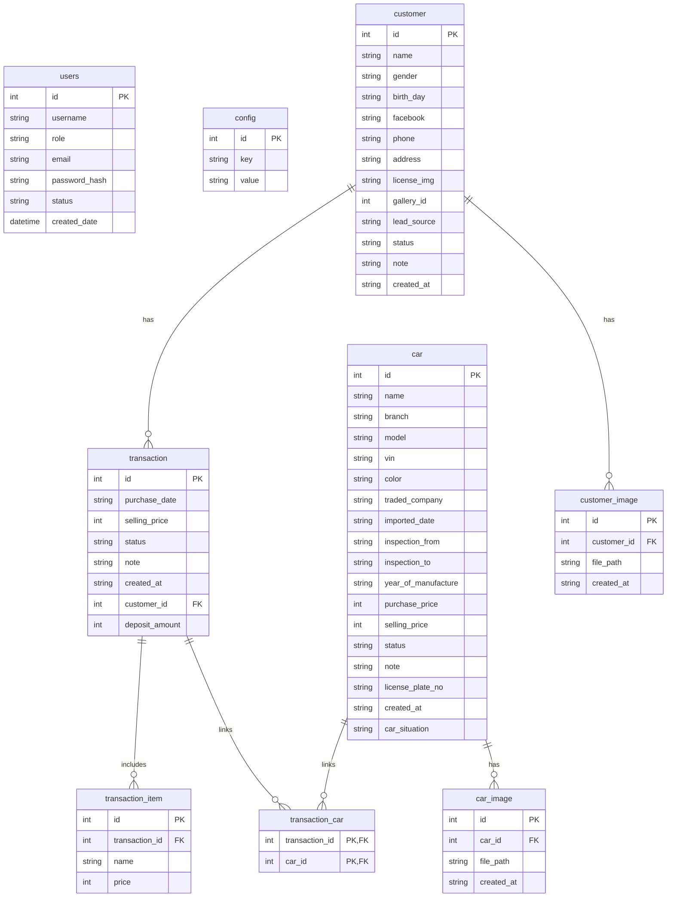

# A3 - Schema Freeze Snapshot + ERD + Data Mapping Rules

## 1) Freeze metadata
- Snapshot date (UTC): 2026-05-20
- Baseline source: Alembic migrations under `migrations/versions/*.py`
- Current schema revision (head): `939f87f778d2`
- Revision chain:
  1. `72ea5c7897f5` (init)
  2. `59c400181352` (transaction item + deposit amount)
  3. `e48da8efbdd0` (car_situation)
  4. `3af95f233bfd` (car_image)
  5. `939f87f778d2` (customer_image)

## 2) Schema snapshot (frozen for migration baseline)

```sql
-- users
CREATE TABLE users (
  id INTEGER PRIMARY KEY AUTOINCREMENT,
  username VARCHAR(80) NOT NULL,
  role VARCHAR,
  email VARCHAR(255) UNIQUE,
  password_hash VARCHAR NOT NULL,
  status VARCHAR,
  created_date DATETIME
);

-- config
CREATE TABLE config (
  id INTEGER PRIMARY KEY AUTOINCREMENT,
  key VARCHAR(255) NOT NULL UNIQUE,
  value VARCHAR(255)
);

-- car
CREATE TABLE car (
  id INTEGER PRIMARY KEY AUTOINCREMENT,
  name VARCHAR NOT NULL,
  branch VARCHAR,
  model VARCHAR,
  vin VARCHAR,
  color VARCHAR,
  traded_company VARCHAR,
  imported_date VARCHAR,
  inspection_from VARCHAR,
  inspection_to VARCHAR,
  year_of_manufacture VARCHAR,
  purchase_price INTEGER,
  selling_price INTEGER,
  status VARCHAR,
  note VARCHAR,
  license_plate_no VARCHAR,
  created_at VARCHAR NOT NULL,
  car_situation VARCHAR
);

-- customer
CREATE TABLE customer (
  id INTEGER PRIMARY KEY AUTOINCREMENT,
  name VARCHAR NOT NULL,
  gender VARCHAR,
  birth_day VARCHAR,
  facebook VARCHAR,
  phone VARCHAR,
  address VARCHAR,
  license_img VARCHAR,
  gallery_id INTEGER,
  lead_source VARCHAR,
  status VARCHAR,
  note VARCHAR,
  created_at VARCHAR NOT NULL
);

-- transaction
CREATE TABLE transaction (
  id INTEGER PRIMARY KEY AUTOINCREMENT,
  purchase_date VARCHAR,
  selling_price INTEGER,
  status VARCHAR,
  note VARCHAR,
  created_at VARCHAR NOT NULL,
  customer_id INTEGER,
  deposit_amount INTEGER,
  FOREIGN KEY (customer_id) REFERENCES customer(id) ON DELETE CASCADE
);

-- transaction_item
CREATE TABLE transaction_item (
  id INTEGER PRIMARY KEY AUTOINCREMENT,
  transaction_id INTEGER NOT NULL,
  name VARCHAR NOT NULL,
  price INTEGER,
  FOREIGN KEY (transaction_id) REFERENCES transaction(id) ON DELETE CASCADE
);

-- transaction_car (many-to-many)
CREATE TABLE transaction_car (
  transaction_id INTEGER NOT NULL,
  car_id INTEGER NOT NULL,
  PRIMARY KEY (transaction_id, car_id),
  FOREIGN KEY (transaction_id) REFERENCES transaction(id),
  FOREIGN KEY (car_id) REFERENCES car(id)
);

-- car_image
CREATE TABLE car_image (
  id INTEGER PRIMARY KEY AUTOINCREMENT,
  car_id INTEGER NOT NULL,
  file_path VARCHAR NOT NULL,
  created_at VARCHAR NOT NULL,
  FOREIGN KEY (car_id) REFERENCES car(id)
);

-- customer_image
CREATE TABLE customer_image (
  id INTEGER PRIMARY KEY AUTOINCREMENT,
  customer_id INTEGER NOT NULL,
  file_path VARCHAR NOT NULL,
  created_at VARCHAR NOT NULL,
  FOREIGN KEY (customer_id) REFERENCES customer(id)
);
```

## 3) ERD (frozen)



## 4) Data mapping rules (legacy => Go domain baseline)
- Naming strategy giữ nguyên tên bảng/cột hiện tại để tránh rủi ro parity trong Phase 1-2.
- Các cột thời gian đang là `VARCHAR` (`created_at`, `purchase_date`, `birth_day`, `imported_date`, `inspection_*`) được parse ở service layer, chưa đổi kiểu ở DB trong migration này.
- `transaction_car` là bảng pivot cho quan hệ N-N giữa `transaction` và `car`, cần map thành `[]Car` trong model giao dịch.
- `car_image` và `customer_image` là quan hệ 1-N; `file_path` phải giữ tương thích với chiến lược upload local hiện tại (`static/uploads/*`).
- `users.password_hash` giữ nguyên format hash từ Flask/Werkzeug để đảm bảo tương thích login ở task C5.
- `config.key` là định danh duy nhất cho system settings; không đổi semantics key trong giai đoạn parity.

## 5) Evidence sources
- `migrations/versions/72ea5c7897f5_init.py`
- `migrations/versions/59c400181352_added_fields.py`
- `migrations/versions/e48da8efbdd0_add_car_situation_column.py`
- `migrations/versions/3af95f233bfd_add_car_image.py`
- `migrations/versions/939f87f778d2_add_customer_image.py`
